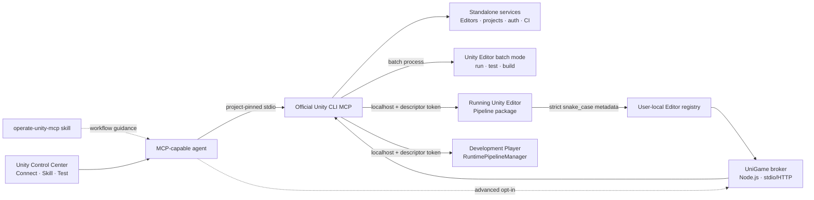

<div align="center">

# Unity CLI MCP Toolkit

**Install Unity, automate projects, author scenes, run tests, build Players, and
control Development Players from any MCP-capable agent.**

[](package.json)
[](https://unity.com/)
[](https://docs.unity.com/en-us/unity-cli/unity-cli)
[](https://docs.unity.com/en-us/unity-production-pipeline/local-tools-cli/unity-pipeline-package)
[](Server~/package.json)
[](LICENSE)

**Official Unity stdio MCP · project-pinned agent setup · optional advanced broker**

</div>

> [!IMPORTANT]
> Unity CLI and Unity Pipeline are experimental. This release pins and verifies
> Unity CLI `1.0.0-beta.2`, Pipeline `0.4.0-exp.1`, and Editor `6000.3.14f1`.
> The server warns on version drift instead of hiding tools.

## Capabilities at a glance

| Mode | What an agent can do | Tools |
| --- | --- | ---: |
| Standalone CLI | Install Editors/modules, manage projects, auth, licenses, Cloud/VCS, configuration, diagnostics, batch run/build/test | 112 |
| Running Editor | Create scenes, GameObjects, components, prefabs and assets; compile, test, bake, configure, capture and build | 140 |
| Development Player | Inspect runtime state, change time/frame rate, simulate input, read logs, hot reload and quit | 14 |
| Toolkit | Inspect catalogs/connections and search capabilities | 3 |

The recommended `operate-unity-mcp` skill teaches an agent to use Unity's
built-in stdio MCP for the current project. The advanced
[operate-unity-cli skill](skills/operate-unity-cli/SKILL.md) covers standalone
CLI, batch mode, the optional UniGame broker, HTTP, and Development Players. The full
[capability map](Documentation~/unity-cli-capabilities.md) distinguishes
built-in commands from batch Editor code, Pipeline tools, and arbitrary C#.

## Quick connect

### 1. Install in Unity

Add the Git package in Package Manager, or add it to
`Packages/manifest.json`:

```json
{
  "dependencies": {
    "com.unigame.unitycli.mcp": "https://github.com/UnioGame/unigame.unitycli.mcp.git"
  }
}
```

Open the guided setup window:

```text
UniGame → Unity CLI MCP
```

The Control Center checks Unity CLI, Pipeline, and this Editor. Click
**Connect** for an installed agent, inspect the compact preview, install the
recommended `operate-unity-mcp` skill, and click **Test MCP**. The registration
starts Unity's official server directly:

```text
<absolute-unity-cli> mcp --project-path <absolute-unity-project>
```

Each project receives a stable private registration named
`unigame_unity_cli_<project>_<path_hash>`, so several projects can coexist
without a shared registration or repository-local machine paths.

> [!TIP]
> The agent-launched MCP server is built into Unity CLI and does not require
> Node.js, npm, TypeScript, the UniGame broker, or a persistent server process.
> The Control Center currently uses Node 20+ for its managed registration,
> backup, rollback, and skill-copy operations.

### 2. Connect an agent

```sh
unity mcp --project-path "<UNITY_PROJECT>"
```

The Control Center discovers clients from the installed Unity CLI and shows
installed clients first. Codex, Cursor, VS Code / GitHub Copilot, Cline,
Claude Code, and Claude Desktop have managed first-line adapters. Existing
registrations and comments are preserved; every mutation has a preview,
fingerprint, and backup.

For a client without a managed adapter, use the official configurator:

```sh
unity mcp configure --list --format json
unity mcp configure <client> --project-path "<UNITY_PROJECT>" --dry-run
```

### 3. Install the recommended Agent Skill

Click **Install** on the `operate-unity-mcp` card. The canonical copy is
installed in the nearest agent workspace:

```text
.agents/skills/operate-unity-mcp
```

If no Git/workspace owner exists, the Unity project is used. The installed
skill includes a self-contained versioned CLI guide and capability map.
Managed mirrors are created only where required by a supported client. Invoke
`$operate-unity-mcp` from a supporting agent.

### 4. Verify and start working

Click **Test MCP** in the Control Center. It launches the official stdio
server, performs `initialize` and `tools/list`, reports the tool count, and
terminates the probe process. `Verified` means the server and Editor tools
responded; `MCP configured` on an agent row means its managed registration is
valid. Restart the agent when the row says **Restart required**.

```sh
unity status --format json
unity list --project-path "<UNITY_PROJECT>" --format json
```

From MCP call:

```text
unity_catalog_status {}
unity_connection_status { "project_path": "<UNITY_PROJECT>" }
unity_editor_editor_status { "project_id": "<PROJECT_ID>" }
```

A ready response confirms the CLI executable, Pipeline descriptor, and Editor
connection.

## Architecture



Unity CLI owns the default MCP implementation. This package supplies the
Control Center, safe project-pinned client registration, skills, versioned
knowledge, and an optional multi-project UniGame broker.

## Supported agents

| Client | Official stdio | Advanced HTTP | Skill | Configuration |
| --- | :---: | :---: | :---: | --- |
| Codex | ✓ | ✓ | Project-local | Developer-local TOML |
| Cursor | ✓ | ✓ | Project-local | Private MCP JSON |
| VS Code / Copilot | ✓ | ✓ | Project-local | User/profile `mcp.json` |
| Cline | ✓ | ✓ | Managed mirror | Private MCP settings |
| Claude Code | ✓ | ✓ | Managed mirror | Private local registration |
| Claude Desktop | Export | Export | DXT | DXT/export manifest |

## Tool model

Every versioned command is an individual MCP tool:

- `unity_cli_projects_create`
- `unity_cli_test`
- `unity_editor_create_scene`
- `unity_editor_create_prefab`
- `unity_editor_recompile`
- `unity_editor_build`
- `unity_player_runtime_status`

Names use `unity_<source>_<command_path>`. Editor selection never guesses the
newest instance: ambiguity returns `TARGET_AMBIGUOUS`; missing, stale, and
not-ready targets return the corresponding stable `TARGET_*` error. Player
routing remains unchanged.

Shared inputs:

| Input | Purpose |
| --- | --- |
| `editor_instance_id` | Select one exact Editor session (highest priority) |
| `project_id` | Select the sole ready Editor for a stable project ID |
| `project_path` | Select by normalized absolute project path |
| `runtimePath` | Select a Development Player descriptor directory |
| `timeoutMs` | Bound the upstream process |
| `confirm` | Acknowledge a high-risk operation |
| `extraArgs` | Forward additive flags from a newer CLI |
| `includeLogs` | Return bounded, redacted logs |

All calls return a stable envelope with `ok`, `source`, `command`, `target`,
`exitCode`, `data`, `warnings`, `errors`, and `durationMs`.

## Unity Control Center

`UniGame → Unity CLI MCP` is a UI Toolkit Control Center:

1. **Project readiness** gives compact Unity CLI, Pipeline, and Editor states.
2. **Official stdio MCP** has one prominent green readiness lamp and
   **Test MCP**. There is no misleading Start button: an agent starts stdio
   automatically.
3. **Agents** lists detected clients first. Each row has one status and one
   primary action: Connect, Repair, or Disconnect.
4. **Agent Skills** independently manages the recommended
   `operate-unity-mcp` and advanced `operate-unity-cli` skills.
5. **Advanced** contains the optional Node broker, HTTP lifecycle, dynamic
   Editor registry, legacy registration, rollback, and sanitized diagnostics.

Every mutation opens a compact preview for that action and creates an atomic
backup after confirmation. Unknown same-name registrations and modified skill
copies remain user-owned unless a reviewed force repair is explicitly
confirmed. Opening the window, refreshing, testing prerequisites, or
cancelling a preview never changes configuration.

Pipeline `0.4.0-exp.1` and the native Unity CLI each show a compact
**Install** action only when missing. Both require confirmation. Pipeline uses
Unity Package Manager; the CLI uses Unity's official installer for the current
platform with the beta channel. A failed CLI install exposes **Copy Command**
and **Docs** while keeping sanitized output under **Advanced**. Node is used
by the managed setup backend and optional broker, never by the official MCP
process launched by an agent. The toolkit never changes `PATH`, returns a
license, or edits Cloud/VCS state.

## stdio and HTTP lifecycle

Official stdio is the default. Each managed agent registration starts
`unity mcp --project-path <project>` on demand and owns that child process.
No permanent process, Node runtime, port, token, or shared lease is involved.

The optional UniGame broker remains available under **Advanced**. Its HTTP
transport binds only to `127.0.0.1`, validates Host and Origin, and accepts a
capability stored in a protected local file. Each Editor owns an independent
lease; closing one cannot stop sessions owned by another Editor. HTTP stops
ten seconds after the last live lease unless keep-alive is explicitly enabled.

For an automatically assigned HTTP port, start the broker first, refresh until
the actual endpoint is visible, then preview and apply agent registrations. A
fixed free port may be previewed and applied before broker startup. Apply fails
with `HTTP_ENDPOINT_NOT_READY` instead of writing a registration with port `0`.

## Common workflows

### Create and save a scene

```text
unity_editor_create_scene {
  "project_path": "<UNITY_PROJECT>",
  "path": "Assets/Automation/Probe.unity",
  "confirm": true
}

unity_editor_create_gameobject {
  "project_path": "<UNITY_PROJECT>",
  "name": "ProbeCube",
  "primitive": "cube",
  "confirm": true
}

unity_editor_save_scene {
  "project_path": "<UNITY_PROJECT>",
  "confirm": true
}
```

### Compile and test

```text
unity_editor_recompile {
  "project_path": "<UNITY_PROJECT>",
  "confirm": true
}
unity_editor_recompile_status { "project_path": "<UNITY_PROJECT>" }
unity_editor_run_tests {
  "project_path": "<UNITY_PROJECT>",
  "mode": "EditMode",
  "filter": "Company.Tests"
}
```

For an isolated NUnit XML run, use `unity_cli_test`.

### Build a Player

`unity_editor_build` is a complete asynchronous Pipeline build operation; poll
`unity_editor_build_status`. In contrast, top-level `unity_cli_build` starts a
batch Editor and requires a project-owned `--execute-method`.

### Control a Development Player

Add `Unity.Pipeline.RuntimePipelineManager`, enable `enableInBuilds`, and make
a standalone Development Build. Point `runtimePath` to the folder containing
`.unity-pipeline-runtime-port`. Never enable Pipeline in a production build.

## Safety

> [!WARNING]
> Install/uninstall, licensing, Cloud/VCS links, deletions, builds, target
> switches, arbitrary C#, menu execution, hot reload and Player quit require
> `confirm: true`.

- Processes are spawned with argument arrays and `shell: false`.
- Output is bounded and tokens, passwords, serials and credential-bearing URLs
  are redacted.
- Secret-bearing operations should reference environment variables or
  protected files as `env:VARIABLE` or `file:/protected/path`; direct secret
  values are rejected.
- Pipeline's authoring root and native `dry_run`/`confirm` checks remain active.
- Batch Editor logs can echo process arguments. Review logs before publishing
  CI artifacts.
- Agent config changes are global and private; repository MCP config is
  never changed by default.
- Setup writes are previewed, backed up, atomic, fingerprinted, and reversible.

## Development

```sh
cd Server~
npm ci
npm test
npm run build
npm run catalog:generate -- --cli "<UNITY_CLI_PATH>"
npm run pack:check
```

After opening a Pipeline-enabled Editor, append:

```sh
npm run catalog:generate -- \
  --cli "<UNITY_CLI_PATH>" \
  --editor-project "<UNITY_PROJECT>"
```

Validate the skill:

```sh
python <skill-creator>/scripts/quick_validate.py \
  skills/operate-unity-mcp
python <skill-creator>/scripts/quick_validate.py \
  skills/operate-unity-cli
```

The setup tests use isolated fake-home directories for all agent adapters and
never touch real client configuration. The E2E script connects through a real MCP SDK client, creates a 55-cube
pyramid in a disposable project, verifies every name and position, saves the
scene, and checks compilation:

```sh
npm run test:e2e -- \
  --project "<DISPOSABLE_UNITY_PROJECT>" \
  --cli "<UNITY_CLI_PATH>"
```

## Versioning and limitations

- The committed catalogs target CLI `1.0.0-beta.2`, Pipeline
  `0.4.0-exp.1`, and Editor `6000.3.14f1`.
- Pipeline requires Unity 6+.
- The Editor Pipeline endpoint requires a normally opened Editor; launching
  the Editor itself with `-batchmode` does not publish the endpoint in
  Pipeline `0.4.0-exp.1`.
- Player tools require a standalone Development Build and explicit
  `RuntimePipelineManager`.
- Timeline, AI Navigation, Input System and Test tools require their
  corresponding Unity packages.
- `unity projects new` can fail when Unity's downloaded template archive is
  unavailable; this is an upstream beta failure and is returned unchanged.
- Online documentation can lag the executable. Installed recursive `--help`
  and live `unity list --format json` remain authoritative.
- Client config formats can evolve. Adapters preserve unmanaged same-name
  registrations by default; replacement requires a reviewed Apply with explicit
  `force`, and a rollback backup is created first.
- Node 20+ is required by Control Center configuration management and the
  optional broker/HTTP transport. The official Unity stdio MCP process itself
  does not require Node.

## Documentation

- [Complete capability map](Documentation~/unity-cli-capabilities.md)
- [Recommended official MCP workflow](skills/operate-unity-mcp/SKILL.md)
- [Agent workflow](skills/operate-unity-cli/SKILL.md)
- [Recipes](skills/operate-unity-cli/references/recipes.md)
- [MCP contract](skills/operate-unity-cli/references/mcp-tools.md)
- [Setup and agent registration](skills/operate-unity-cli/references/setup-and-agents.md)
- [Official Unity CLI documentation](https://docs.unity.com/en-us/unity-cli/unity-cli)
- [Official Pipeline package documentation](https://docs.unity.com/en-us/unity-production-pipeline/local-tools-cli/unity-pipeline-package)

---

<div align="center">

Built for agents that need to operate Unity deliberately, observably, and
without pretending every C# possibility is a built-in CLI command.

</div>
